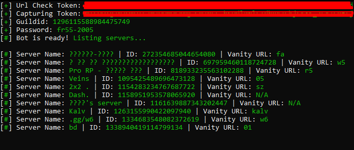

# 💻 Discord VANITY Url V2 Fixed 

> 📦 **Note:** The program file is included inside a `.rar` archive because the original `.exe` file exceeds GitHub's 25MB upload limit.

---

## 📝 Description

This is a simple tool that [insert a brief description of what your program does – e.g., "helps automate tasks" or "monitors something"].

- The `Discord Vanity Url V2.exe` file could not be uploaded directly due to size restrictions.
- It has been compressed into a `Discord Vanity Url V2.rar` archive for download.

---

## 📷 Screenshot

  
*This is how the program looks when running.*

---

## 🧰 How to Use

1. Download the `Discord Vanity Url V2.rar` file from this repository.
2. Extract it using WinRAR, 7-Zip, or any archive manager.
3. Run the `Discord Vanity Url V2.exe` file inside the extracted folder.

---

## ⚠️ Notes

- Make sure your antivirus doesn’t block the file from running.
- No installation needed — just extract and run.

---

## 📬 Contact

If you encounter any issues, feel free to contact me on telegram `dolkiller`. 
